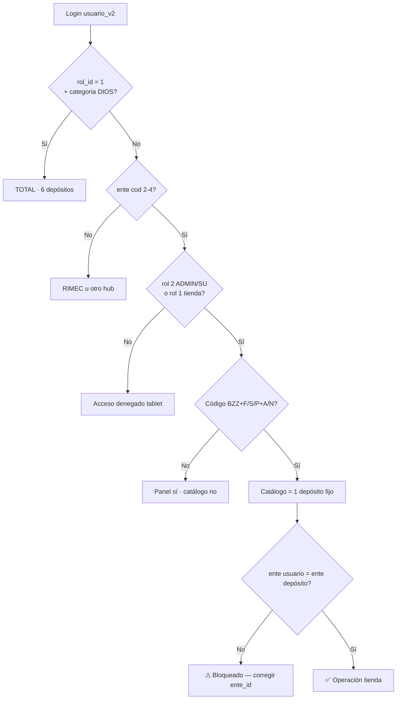

# Ayuda memoria — Usuarios BZZ · Roles · Accesos

> **Para:** Director (Héctor Segovia)  
> **Uso:** Administrar cuentas `usuario_v2`, entender qué ve cada perfil y dónde entra.  
> **Etapa cerrada:** `.claude/4_etapas/ETAPA_ACCESOS_HOLDING_BZZ_CERRADA.md`  
> **Contraseñas tienda BZZ:** el número de **depósito** (`2700`, `3200`, `2900`…) — visible en columna `password` y hasheado en `password_hash`. Reset: `python scripts/sincronizar_password_bzz_deposito.py`  
> **Matriz canónica:** `.claude/1_fundamentos/1.3_politicas/MATRIZ_ROLES_ACCESOS_HOLDING.md`  
> **Doc técnico:** [ACCESOS_BZZ_RIMEC_WEB.md](./ACCESOS_BZZ_RIMEC_WEB.md)

---

## 🎴 TARJETA DIRECTOR — regla en 30 segundos

```
┌─────────────────────────────────────────────────────────────────────────┐
│  USUARIO = Ente × Rol × Categoría  (tabla usuario_v2)                   │
│                                                                         │
│  Ente cod 1     → RIMEC      (importadora)                              │
│  Ente cod 2–4   → BAZZAR     (Fernando · San Martín · Palma)            │
│  Ente cod 5     → BAZZAR WEB (e-commerce)                               │
│                                                                         │
│  Código tienda POS:  BZZ + sede(F/S/P) + segmento(A/N)                  │
│    BZZSN = San Martín Niños (2700)   BZZPN = Palma Niños (3200)         │
│                                                                         │
│  Report  → http://localhost:3000/login                                  │
│  Tablet  → http://localhost:3002/login                                  │
│  Tras cambiar ente/rol → LOGOUT + LOGIN (sesión v4 Report)              │
└─────────────────────────────────────────────────────────────────────────┘
```

---

## 1. Los tres ejes (triada)

| Eje | Campo BD | Niveles | Regla |
|-----|----------|---------|-------|
| **Ente** | `ente_id` → `entes.codigo` | 1 RIMEC · 2 Fernando · 3 San Martín · 4 Palma · 5 Bazzar Web | Define **qué columna** del hub Report ve |
| **Rol orgánico** | `rol_id` → `maestro_rol_acceso` | 1 Gerente · 2 Admin · 3 Ejecutor · 4 Externo | Empresa / banda de poder |
| **Categoría** | `categoria` / `categoria_id` | 1 DIOS · 2 ADMIN · 3 VENDEDOR · 4 OPERARIO | Afinado dentro del rol |

**Ley:** categoría.nivel ≥ rol.nivel · **DIOS** solo ente 1 + rol 1 + cat 1.

---

## 2. Nomenclatura BZZ → depósito tienda

Patrón usuario tablet / caja: **`BZZ` + sede + segmento**

| Usuario | Sede | Segmento | Depósito | `cliente_id` | Tabla stock |
|---------|------|----------|----------|--------------|-------------|
| **BZZFA** | Fernando (F) | Adultos (A) | FER-A | 2100 | `deposito_1_2100_tienda` |
| **BZZFN** | Fernando (F) | Niños (N) | FER-N | 2900 | `deposito_1_2900_tienda` |
| **BZZSA** | San Martín (S) | Adultos (A) | SM-A | 2400 | `deposito_1_2400_tienda` |
| **BZZSN** | San Martín (S) | Niños (N) | SM-N | 2700 | `deposito_1_2700_tienda` |
| **BZZPA** | Palma (P) | Adultos (A) | PAL-A | 3100 | `deposito_1_3100_tienda` |
| **BZZPN** | Palma (P) | Niños (N) | PAL-N | 3200 | `deposito_1_3200_tienda` |

> **En BD hoy** existen: BZZF · BZZFN · BZZSN · BZZPN · BZZP · BZZS — faltan BZZFA · BZZSA · BZZPA.

---

## 3. Tarjetas de usuario (estado BD — actualizado 2026-06-26)

> Hotfix menú Report: [HOTFIX_BZZ_MENU_REPORT_20260626.md](./HOTFIX_BZZ_MENU_REPORT_20260626.md)  
> **Regla:** todo `BZZ*` → `rol_id=2`. ADMIN = Report Bazzar · VENDEDOR = solo Tablet POS.

| Usuario | rol_id | cat | ente | Report | Tablet |
|---------|--------|-----|------|--------|--------|
| BZZF | 2 | ADMIN | 2 | Bazzar only | ✅ |
| BZZFN | 2 | ADMIN | 2 | Bazzar only | ✅ |
| BZZPN | 2 | ADMIN | 4 | Bazzar only | ✅ |
| BZZSN | 2 | ADMIN | 3 | Bazzar only | ✅ |
| BZZP | 2 | VENDEDOR | 4 | ❌ | POS ✅ |
| BZZS | 2 | VENDEDOR | 3 | ❌ | POS ✅ |

---

## 3b. Tarjetas históricas (pre-hotfix — referencia)

### 🟢 BZZPN — Palma Niños *(referencia tienda)*

| Campo | Valor |
|-------|-------|
| Ente | **4 Palma** |
| Rol / Cat | rol_id **1** · ADMIN (nivel 2) |
| Depósito | **3200** · Palma · Niños |
| **Report** | Hub completo (rol 1) — *canónico tienda: solo columna Bazzar* |
| **Tablet panel** | ✅ |
| **Catálogo `/cadena`** | ✅ solo Palma Niños (bloqueado a su depósito) |

---

### 🟢 BZZFN — Fernando Niños

| Campo | Valor |
|-------|-------|
| Ente | **2 Fernando** |
| Rol / Cat | rol_id **1** · ADMIN |
| Depósito | **2900** · Fernando · Niños |
| **Report** | Hub amplio (rol 1) |
| **Tablet** | ✅ panel + ✅ `/cadena` Fdo. Niños |

---

### 🟡 BZZF — Fernando *(código incompleto)*

| Campo | Valor |
|-------|-------|
| Ente | **2 Fernando** |
| Rol / Cat | rol_id **1** · ADMIN |
| Depósito | ❌ no resuelve (`BZZF` ≠ patrón `BZZ+F/S/P+A/N`) |
| **Tablet `/cadena`** | ❌ hasta renombrar (ej. **BZZFA**) |

---

### 🔴 BZZSN — San Martín Niños *(⚠ ente mal asignado)*

| Campo | Valor | **Debería ser** |
|-------|-------|-----------------|
| Ente BD | **3 San Martín** ✅ | — |
| Rol / Cat | rol_id **2** · ADMIN | ok |
| Depósito por nombre | **2700** SM-N | ok |
| **Report** | Ve todo RIMEC (ente 1) | Solo Bazzar |
| **Tablet `/cadena`** | ❌ ente ≠ depósito | ✅ tras fix ente |

**Fix sugerido:** `UPDATE usuario_v2 SET ente_id = (SELECT id_ente FROM entes WHERE codigo=3) WHERE descp_usuario='BZZSN'`

---

### 🔴 BZZP · BZZS — Legacy RIMEC vendedor

| Campo | Valor |
|-------|-------|
| Ente | 1 RIMEC |
| Rol / Cat | rol_id **3** · VENDEDOR |
| **Report** | Solo `/ventas-fotos` |
| **Tablet** | ❌ login rechazado (solo rol 1 o rol 2 ADMIN/SU) |

---

### 🟢 Nivel Dios — Guido · HECTOR · Tito

| Campo | Valor |
|-------|-------|
| Ente | 1 RIMEC |
| Rol / Cat | rol_id **1** · **DIOS** |
| **Report** | **TOTAL** incl. `/aprobaciones` |
| **Tablet** | **TOTAL** · `/cadena` las **6 tiendas** |

---

## 4. Matriz visual — ¿Qué módulos ve cada perfil?

### Report (`localhost:3000`)

| Módulo | Ruta | DIOS | ADMIN RIMEC | VENDEDOR RIMEC | ADMIN Bazzar (ente 2–4) |
|--------|------|:----:|:-----------:|:--------------:|:-----------------------:|
| Sales Report | `/rimec` | 🟢 | 🟢 | 🔴 | 🔴 |
| Ventas + Fotos | `/ventas-fotos` | 🟢 | 🟢 | 🟢 | 🔴 |
| Aprobaciones | `/aprobaciones` | 🟢 | 🔴 | 🔴 | 🔴 |
| Pilares / RRHH / Import | `/pilares` … | 🟢 | 🟢* | 🔴 | 🔴 |
| Retail Stock | `/retail` | 🟢 | 🟢 | 🔴 | 🟢 |
| Depósitos Bazzar | `/depositos-bazzar` | 🟢 | 🟢 | 🔴 | 🟢 |
| Caja Bazzar | `/tablet-bazzar` | 🟢 | 🟢 | 🔴 | 🟢 |
| Bazzar Web | `/bazzar-web/*` | 🟢 | según ente 5 | 🔴 | 🔴 |
| Admin usuarios | `/pilares/usuarios` | 🟢 dev | 🔴 | 🔴 | 🔴 |

🟢 = acceso · 🔴 = prohibido · \* ADMIN RIMEC sin Aprobaciones

### RIMEC Web (`localhost:3001`)

| Pantalla | DIOS | ADMIN tienda (BZZ*) | VENDEDOR Bazzar |
|----------|:----:|:-------------------:|:---------------:|
| Login catálogo | 🟢 | 🟢 | 🔴 |
| Catálogo + carrito | 🟢 | 🟢 | 🔴 |
| Estadísticas / admin web | 🟢 | según cat ADMIN | 🔴 |

Solo usuarios BZZ con `categoria` **ADMIN** entran en RIMEC Web; **VENDEDOR** tienda queda bloqueado en login.

### Tablet Bazzar (`localhost:3002`)

| Pantalla | DIOS | ADMIN tienda (BZZ*) | VENDEDOR |
|----------|:----:|:-------------------:|:--------:|
| Panel `/` | 🟢 | 🟢 | 🔴 |
| Catálogo `/cadena` | 🟢 6 tiendas | 🟢 **1 depósito** | 🔴 |
| Vista POS `/cadena/vista` | 🟢 | 🟢 mismo depósito | 🔴 |
| Empaque / tickets | 🟢 | 🟢 tienda asignada | 🔴 |

---

## 5. Diagrama — flujo de decisión acceso



---

## 6. Semáforo gerencial

| Color | Significado | Ejemplo |
|-------|-------------|---------|
| 🟢 **TOTAL** | Entra y opera sin límite en esa herramienta | DIOS en Report |
| 🟡 **PARCIAL** | Solo módulos listados o 1 depósito | BZZPN en `/cadena` |
| 🔴 **PROHIBIDO** | No login o pantalla «Acceso restringido» | BZZP en Tablet |

---

## 7. Administración — acciones rápidas

| Tarea | Dónde |
|-------|-------|
| Alta / editar usuario | Report dev → `/pilares/usuarios` |
| Cambiar contraseña | Mismo módulo (genera bcrypt) |
| Ver todos los BZZ | SQL abajo |
| Corregir ente BZZSN | SQL abajo |
| Crear BZZFA / BZZSA / BZZPA | Alta manual con ente 2 / 3 / 4 · rol 2 · ADMIN |
| Doc triada | `report/docs/LEY_TRIADA_ACCESO_HOLDING.md` |
| Matriz holding | `.claude/1_fundamentos/1.3_politicas/MATRIZ_ROLES_ACCESOS_HOLDING.md` |

### SQL auditoría

```sql
SELECT u.descp_usuario,
       u.categoria,
       u.rol_id,
       e.codigo AS ente_cod,
       e.nombre AS ente,
       u.bloqueado
FROM usuario_v2 u
LEFT JOIN entes e ON e.id_ente = u.ente_id
WHERE UPPER(u.descp_usuario) LIKE 'BZZ%'
ORDER BY u.descp_usuario;
```

### SQL fix BZZSN (✅ aplicado 2026-06-10)

Ejecutado por `report/scripts/sincronizar_password_bzz_deposito.py`. Referencia manual:

```sql
UPDATE usuario_v2 u
SET ente_id = e.id_ente
FROM entes e
WHERE e.codigo = 3
  AND UPPER(TRIM(u.descp_usuario)) = 'BZZSN';
```

---

## 8. Checklist al crear usuario tienda nuevo

1. **Ente principal** correcto (2 Fernando · 3 San Martín · 4 Palma) — no RIMEC 1.  
2. **rol_id = 2** (Admin Bazzar) · **categoria = ADMIN** (nivel 2).  
3. **descp_usuario** = patrón `BZZ` + `F|S|P` + `A|N`.  
4. **password_hash** bcrypt (módulo usuarios o script).  
5. Logout + login en Report y Tablet.  
6. Smoke: hub solo Bazzar · `/cadena` muestra **una** tienda.

---

## 9. URLs de prueba

| App | URL |
|-----|-----|
| Report login | http://localhost:3000/login |
| RIMEC Web login | http://localhost:3001/login |
| Tablet login | http://localhost:3002/login |
| Catálogo ventas | http://localhost:3002/cadena |
| Organigrama accesos | http://localhost:3004/accesos |
| Auto-login dev (DIOS) | http://localhost:3002/api/auth/auto-login |
| Admin usuarios (dev) | http://localhost:3000/pilares/usuarios |

---

**Código documento:** `2.3.5.4.1` · **Etapa:** `HOLD-ACCESOS-BZZ-2026` ✅  
**Índice Moria:** `.claude/2_modulos/2.3_report/pilares/INDICE.md`  
**Última actualización:** 2026-06-10
