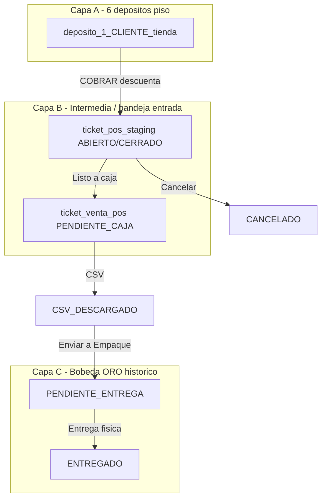

# Flujo canónico POS Bazzar — Director · 6 depósitos · 6 cajas · ORO

> **⚠️ Implementación v2 (2026-06-24):** bandeja única `ticket_bandeja_cajero` — sin dual staging+bandeja en escritura.  
> **Doc operativo completo:** `tablet-bazzar/docs/LOGICA_OPERATIVA_POS_BAZZAR.md`  
> **Stock / sync:** [LOGICA_STOCK_DEPOSITO_SYNC.md](./LOGICA_STOCK_DEPOSITO_SYNC.md)

**Prioridad:** MÁXIMA · **Versión:** 2.0 · **Fecha:** 2026-06-24  
**Autoridad:** Director (Héctor) · **Implementación:** Report `:3001` + Tablet `:3000` · **BD:** Supabase Postgres compartida  
**Relacionado:** [ARQUITECTURA_DOS_TABLAS_CAJA_BOBINA.md](./ARQUITECTURA_DOS_TABLAS_CAJA_BOBINA.md) · [FLUJO_P12_P13_CAJA_BAZZAR.md](./FLUJO_P12_P13_CAJA_BAZZAR.md)

---

## 1. Norte en una frase

Cada tienda vende **solo desde su depósito**, cobra **solo en su caja**, y deja un registro **ORO inmutable** en Bobeda. Los usuarios solo pueden marcar **ENTREGADO**; todo lo demás en ORO lo modifica **solo el Director**.

---

## 2. Las seis parejas depósito ↔ caja (aislamiento absoluto)

| # | Ente | Tipo | `cliente_id` | Depósito piso (stock sesión) | Caja Report |
|---|------|------|--------------|------------------------------|-------------|
| 1 | Fernando | Adultos | **2100** | `deposito_1_2100_tienda` | `/tablet-bazzar/2100` |
| 2 | Fernando | Niños | **2900** | `deposito_1_2900_tienda` | `/tablet-bazzar/2900` |
| 3 | San Martín | Adultos | **2400** | `deposito_1_2400_tienda` | `/tablet-bazzar/2400` |
| 4 | San Martín | Niños | **2700** | `deposito_1_2700_tienda` | `/tablet-bazzar/2700` |
| 5 | Palma | Adultos | **3100** | `deposito_1_3100_tienda` | `/tablet-bazzar/3100` |
| 6 | Palma | Niños | **3200** | `deposito_1_3200_tienda` | `/tablet-bazzar/3200` |

### Ley de procedencia (obligatoria)

1. Toda fila operativa lleva **`cliente_id`** = tienda de origen.
2. **Prohibido** vender, descontar stock, listar bandeja o facturar cruzando `cliente_id`.
3. Vendedor tablet solo opera el depósito de su piso; cajero Report solo su caja asignada.
4. APIs y queries deben filtrar **`WHERE cliente_id = :mi_tienda`** — nunca confiar en el navegador.

---

## 3. Tres capas de datos (modelo v2 — bandeja única)

```
┌─────────────────────────────────────────────────────────────────────────┐
│ CAPA A · STOCK SESIÓN · sync Report desde Retail                        │
│  deposito_1_{cliente_id}_tienda  (×6)                                   │
└─────────────────────────────────────────────────────────────────────────┘
                                    │ sync-cart: −1 por par · cancelar: +1
                                    ▼
┌─────────────────────────────────────────────────────────────────────────┐
│ CAPA B · OPERATIVA · ticket_bandeja_cajero (tablet + caja Report)       │
│  ABIERTO → CERRAR → PENDIENTE_CAJA → CSV → Enviar Empaque              │
└─────────────────────────────────────────────────────────────────────────┘
                                    │
                                    ▼
┌─────────────────────────────────────────────────────────────────────────┐
│ CAPA C · BOBINA ORO · bobeda_venta_pos                                   │
│  Import histórico · Empaque · Sales Report Bazzar futuro                │
└─────────────────────────────────────────────────────────────────────────┘
```

**Legacy (no escribir):** `ticket_pos_staging`, `ticket_venta_pos`.

### Deuda cerrada en v2

- ✅ Una tabla operativa `ticket_bandeja_cajero`
- ✅ CERRAR tablet → `PENDIENTE_CAJA` (no «Listo → caja»)
- ✅ Validación stock sync-cart incluye reserva bandeja
- ✅ Migración 009 · FI_FA por lote

---

## 3b. Capas v1 (histórico — superseded)

<details>
<summary>Modelo dual staging+bandeja (solo referencia histórica)</summary>

```
┌─────────────────────────────────────────────────────────────────────────┐
│ CAPA B · SESIÓN PISO (tablet) — OBSOLETO EN ESCRITURA                     │
│  ticket_pos_staging + ticket_pos_staging_linea                          │
└─────────────────────────────────────────────────────────────────────────┘
```

</details>

---

## 4. Máquina de estados canónica

### 4.1 Sesión piso — `ticket_pos_staging.estado`

| Estado | Significado | Stock depósito | Visible tablet “Facturas internas” |
|--------|-------------|----------------|-------------------------------------|
| `ABIERTO` | Venta en curso / editable | Descontado | Sí |
| `CERRADO` | Listo para enviar a caja | Descontado | Sí |
| `CANCELADO` | Anulado vendedor | Restaurado | No |
| `ORO` | Ya enviado a cola cajero | Sin mover otra vez | No (ver sección “En caja Report”) |

Transiciones permitidas:

```
ABIERTO ──CERRAR──► CERRADO ──Listo→caja──► ORO (crea cola cajero)
   ▲                    │
   └── reabrir ─────────┘
ABIERTO/CERRADO ──Cancelar──► CANCELADO
ORO ──reabrir catálogo (Director/flujo controlado)──► ABIERTO + borra cola EMITIDO
```

### 4.2 Cola cajero + ORO — `ticket_venta_pos.estado`

**Nombres canónicos (objetivo)** ↔ **código hoy (transición)**

| Fase | Estado canónico | Código hoy | Bandeja | Quién |
|------|-----------------|------------|---------|-------|
| Entrada cajero | `PENDIENTE_CAJA` | `EMITIDO` | Report card A operativa | Cajero |
| CSV generado | `CSV_DESCARGADO` | *(falta)* | Habilita “Enviar a Empaque” | Cajero |
| En Bobeda · espera entrega | `PENDIENTE_ENTREGA` | `FACTURADO` *(mal nombre)* | Empaque tablet / entregas | Empaque |
| Cierre físico | `ENTREGADO` | *(falta)* | Archivo | Operador entregas |
| Anulación | `ANULADO` | *(falta)* | — | **Solo Director** |

Transiciones obligatorias:

```
PENDIENTE_CAJA ──Descargar CSV──► CSV_DESCARGADO
CSV_DESCARGADO ──Enviar a Empaque──► PENDIENTE_ENTREGA   ← aquí entra ORO histórico
PENDIENTE_ENTREGA ──Confirmar entrega física──► ENTREGADO
 cualquier ──Solo Director──► ANULADO
```

**Regla de oro Bobeda:** después de `PENDIENTE_ENTREGA`, **ningún usuario** edita titular, quita pares ni reabre — salvo **`ENTREGADO`**. El cajero solo edita en fase `PENDIENTE_CAJA` / `CSV_DESCARGADO`.

---

## 5. Flujo operativo real (turno de tienda)

### Fase 0 — Antes de abrir piso

1. Admin Report importa Retail y ejecuta **Actualizar stock** → llena los 6 depósitos piso.
2. **Bloqueo:** si queda staging `ABIERTO` o `CERRADO`, no se puede sync (409).
3. Bobeda de días anteriores **no se toca**.

### Fase 1 — Venta piso (Tablet `:3000/cadena`)

1. Vendedor identifica PIN · elige marca · agrega pares al carrito.
2. **COBRAR** → crea `ticket_pos_staging` **`ABIERTO`** · descuenta stock del depósito **de esa tienda**.
3. Editar / cancelar / reabrir → solo afecta staging + stock sesión.
4. **Listo → caja** → staging **`ORO`** · crea filas `ticket_venta_pos` **`PENDIENTE_CAJA`** (`EMITIDO` hoy).

### Fase 2 — Caja (Report `:3001/tablet-bazzar/{cliente_id}`)

1. Cajero abre **Caja operativa** · bandeja debe listar **todos** los `PENDIENTE_CAJA` de **su** `cliente_id` (sin filtro “solo hoy”).
2. Match cliente: «¿A nombre de quién?» · puede corregir titular/CI y **quitar par** (solo en esta fase).
3. **Descargar CSV** → import facturador legacy → cobro real en caja física.
4. Marcar **`CSV_DESCARGADO`**.
5. **Enviar a Empaque** → pasa a **`PENDIENTE_ENTREGA`** · sale de bandeja cajero · **entra ORO histórico**.
6. Bandeja cajero ideal: **VACÍA**.

### Fase 3 — Empaque / entrega (Tablet `:3000/empaque` ⏳)

1. Operador ve Bobeda **`PENDIENTE_ENTREGA`** de su tienda.
2. QC visual (foto · molécula L·R·Mat·Color·grada).
3. Cliente recibe mercadería → **`ENTREGADO`** (única mutación de usuario permitida en ORO).

### Fase 4 — Fin de sesión stock

1. Verificar: bandeja cajero vacía · staging sin `ABIERTO`/`CERRADO`.
2. **Actualizar stock** → depósito sesión se reimporta · **Bobeda intacta**.

---

## 6. Diagrama de flujo (mermaid)



---

## 7. Matriz de permisos

| Acción | Vendedor tablet | Cajero Report | Empaque | Director |
|--------|-----------------|---------------|---------|----------|
| Crear venta staging | ✅ su tienda | ❌ | ❌ | ✅ |
| Editar carrito / reabrir staging | ✅ pre-ORO | ❌ | ❌ | ✅ |
| Cancelar pedido + restaurar stock | ✅ | ❌ | ❌ | ✅ |
| Ver bandeja cajero | 👁 su tienda | ✅ su caja | ❌ | ✅ todas |
| Editar titular / quitar par | ❌ | ✅ pre-ORO | ❌ | ✅ |
| Descargar CSV | ❌ | ✅ | ❌ | ✅ |
| Enviar a Empaque | ❌ | ✅ | ❌ | ✅ |
| Marcar ENTREGADO | ❌ | ❌ | ✅ su tienda | ✅ |
| ANULADO / corrección ORO | ❌ | ❌ | ❌ | **✅ solo Director** |
| Sync depósito Retail | ❌ | ❌ | ❌ | ✅ admin |

---

## 8. Reglas de consulta (paridad obligatoria)

Toda pantalla que muestre “pendiente” debe usar **las mismas reglas**:

| Vista | Fuente | Filtro estado | Filtro fecha |
|-------|--------|---------------|--------------|
| Hub 6 cajas | `ticket_venta_pos` | `PENDIENTE_CAJA` | **Ninguno** |
| Bandeja cajero Report | `ticket_venta_pos` | `PENDIENTE_CAJA` | **Ninguno** |
| Tablet “En caja Report” | `ticket_venta_pos` | `PENDIENTE_CAJA` | **Ninguno** |
| Tablet staging panel | `ticket_pos_staging` | `ABIERTO`, `CERRADO` | Ninguno |
| Empaque pendientes | `ticket_venta_pos` | `PENDIENTE_ENTREGA` | Ninguno |
| Métricas “vendidos hoy” | `ticket_venta_pos` | todos del día | **Turno / fecha local** |

**Prohibido:** mezclar “pendiente de caja” con “creado hoy UTC” — rompe pedidos de cierre de turno (bug FI-1).

---

## 9. Identificadores visibles

| ID | Formato | Significado |
|----|---------|-------------|
| Factura interna | `POS-FI-{staging_id}` | Agrupa todos los pares de un pedido |
| Ticket molecular | `POS-{cliente_id}-{timestamp}-{rnd}-{n}` | Una fila = un par en Bobeda |
| Staging código | `STG-{cliente_id}-…` | Trazabilidad sesión piso |

---

## 10. Gap map — código hoy vs canónico

| # | Canónico | Hoy | Riesgo | Prioridad |
|---|----------|-----|--------|-----------|
| G1 | Un solo módulo query cola cajero | SQL duplicado Report + Tablet | Desincronización UI | **P0** |
| G2 | `PENDIENTE_CAJA` sin filtro fecha | Report parcialmente corregido · Tablet `tickets-caja-read.ts` aún filtra hoy | Tablet ciega | **P0** |
| G3 | Estado `CSV_DESCARGADO` | No existe | Cajero salta directo a mal nombre `FACTURADO` | **P0** |
| G4 | `Enviar a Empaque` → `PENDIENTE_ENTREGA` | Botón “Marcar FACTURADO” | Semántica incorrecta · no hay Empaque | **P0** |
| G5 | `ENTREGADO` solo usuario | No implementado | ORO sin cierre físico | **P1** |
| G6 | Edición cajero solo pre-ORO | `eliminarLinea` / titular en `EMITIDO` OK · falta bloqueo post-Empaque | Fuga de edits | **P1** |
| G7 | Renombrar estados BD | `EMITIDO`/`FACTURADO` legacy | Confusión agentes | **P1** |
| G8 | Módulo Empaque tablet | `/empaque` ⏳ | Tramo P-13 ausente | **P1** |
| G9 | Query compartida npm / API Report | Dos repos independientes | Regresiones | **P2** |
| G10 | Turno `America/Asuncion` vs UTC | `startOfTodayUtc()` en métricas | KPIs falsos | **P2** |

---

## 11. Plan de ejecución (orden recomendado)

### Ola P0 — Paridad y nombres (sin cambiar operación de piso)

1. Migración estados: `EMITIDO`→`PENDIENTE_CAJA`, `FACTURADO`→`PENDIENTE_ENTREGA`, agregar `CSV_DESCARGADO`, `ENTREGADO`.
2. Extraer **`lib/pos-bazzar/cola-cajero.ts`** (o paquete compartido) — una función `listPendientesCaja(cliente_id)`.
3. Consumir la misma función en Report hub, bandeja, Tablet `/api/tickets/caja`.
4. Reemplazar botón **Marcar FACTURADO** por flujo: CSV → **Enviar a Empaque**.

### Ola P1 — Empaque y blindaje ORO

5. Tablet `/empaque`: bandeja `PENDIENTE_ENTREGA` · acción **`ENTREGADO`**.
6. Trigger o check: rechazar UPDATE/DELETE en ORO salvo `ENTREGADO` y rol Director.
7. Documentar CHUSAR P-13 alineado a este doc.

### Ola P2 — Robustez

8. Turno comercial local para métricas “hoy”.
9. Tests de aislamiento: tienda 2100 no ve 2400.
10. Smoke semanal: IC→…→POS→caja→empaque→ENTREGADO.

---

## 12. Checklist smoke (Director / QA)

- [ ] Vendo 2 pares en Fernando Adultos 2100 · Listo→caja.
- [ ] Aparece `POS-FI-n` en Report bandeja **y** Tablet “En caja Report”.
- [ ] Hub muestra **1 pendiente** en card 2100.
- [ ] Cajero descarga CSV · marca CSV descargado · **Enviar a Empaque**.
- [ ] Desaparece de bandeja cajero · aparece en Empaque.
- [ ] Operador marca **ENTREGADO** · no editable por cajero.
- [ ] Sync depósito OK con bandeja vacía.
- [ ] San Martín 2400 **no** ve pedidos de 2100.

---

## 13. Referencias de código (implementación actual)

| Pieza | Repo | Ruta |
|-------|------|------|
| Staging + promover ORO | tablet-bazzar | `lib/server/tickets-staging.ts` |
| Lectura cola cajero tablet | tablet-bazzar | `lib/server/tickets-caja-read.ts` |
| Bandeja + hub Report | report | `src/lib/caja-bazzar/tickets-db.ts` |
| Edición cajero | report | `src/lib/caja-bazzar/tickets-edit.ts` |
| 6 tiendas | ambos | `*/depositos-config.ts` |
| Guard sync | report | `src/lib/caja-bazzar/staging-guard.ts` |

---

**Documento canónico aprobado por lógica Director · base para OT, migraciones y cierre etapa Caja Bazzar.**
